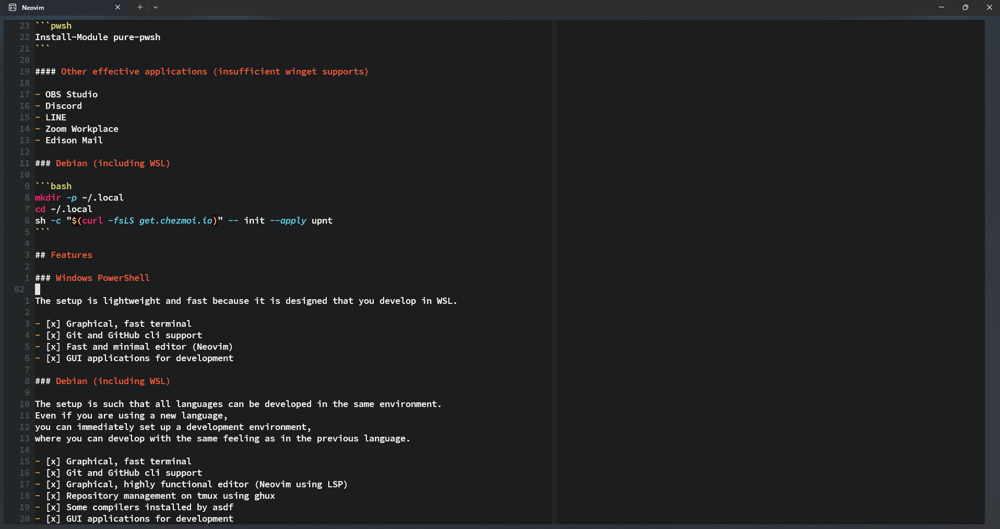
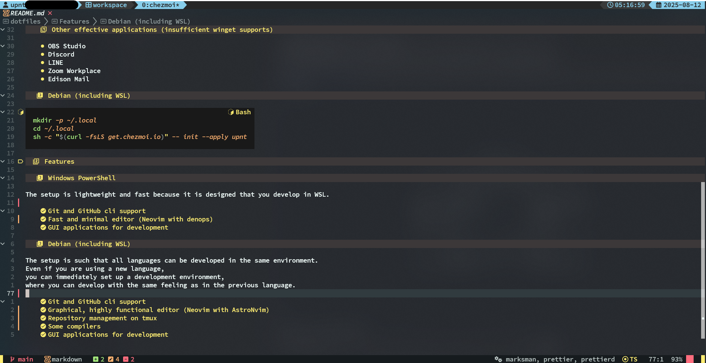

# dotfiles

[](https://github.com/upnt/dotfiles/actions/workflows/github-code-scanning/codeql)
[](https://github.com/upnt/dotfiles/actions/workflows/installation.yml)

Dotfiles managed by chezmoi

## Support

- [x] Debian (including WSL)
- [x] Windows
- [ ] macOS

## Installation

### Windows PowerShell

```powershell
Set-ExecutionPolicy RemoteSigned
winget install Git.Git -s winget
winget install Microsoft.Powershell -s winget
iex "&{$(irm 'https://get.chezmoi.io/ps1')} -b '$HOME\.local\bin'"
git clone https://github.com/upnt/dotfiles "$HOME\.local\share\chezmoi"
& "$HOME\.local\bin\chezmoi" init
```

If you're a OneDrive user, simply add the following script to enhance your setup!
Just drop it into
`$HOME\OneDrive\Documents\PowerShell\Microsoft.PowerShell_profile.ps1`,

```powershell:Microsoft.PowerShell_profile.ps1
. "$Home\AppData\Local\PowerShell\Microsoft.PowerShell_profile.ps1"
Import-Module pure-pwsh
```

and install from the gallery

```pwsh
Install-Module pure-pwsh
```

#### Other effective applications (insufficient winget supports)

- OBS Studio
- Discord
- LINE
- Zoom Workplace
- Edison Mail

### Debian (including WSL)

```bash
mkdir -p ~/.local
cd ~/.local
sh -c "$(curl -fsLS get.chezmoi.io)" -- init --apply upnt
```

## Features

### Windows PowerShell

The development environment is lightweight and fast because it is designed for WSL.

- [x] Graphical UI

  - Fast and minimal editor (Neovim with denops)

  

- [x] Git and GitHub cli
- [x] GUI applications for development

### Debian (including WSL)

The development environment provides a consistent interface and workflow across all languages.

- [x] Graphical UI

  - Graphical, highly functional editor (Neovim with AstroNvim)
  - Repository management on tmux with fzf

  

- [x] Git and GitHub cli
- [x] Some compilers
- [x] GUI applications for development (only Linux GUI)
